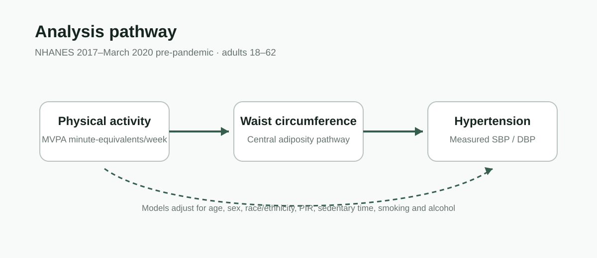

# Physical Activity, Adiposity & Hypertension

A reproducible **NHANES 2017–March 2020 pre-pandemic** analysis examining whether waist circumference helps explain the association between moderate-to-vigorous physical activity (MVPA) and hypertension.



## Research question

How is MVPA associated with hypertension, and how does the estimated MVPA association change after adding **waist circumference** to the outcome model?

The analysis uses a pathway-oriented, mediation-style regression sequence:

```
MVPA  ───────► Hypertension
  │                 ▲
  └──► Waist ───────┘
```

This repository presents the **analysis code and reproducible outputs only**. Classroom instructions, assignment rubrics, proposal documents, and student-facing guidance are intentionally excluded.

## Data

Public NHANES 2017–March 2020 pre-pandemic files are downloaded directly by the R script:

- Demographics
- Body measures
- Blood pressure
- Physical activity
- Blood-pressure questionnaire
- Smoking
- Alcohol use

The workflow focuses on adults ages **18–62**, uses complete cases for the modeled variables, and excludes participants reporting blood-pressure medication use.

## Variables

**Exposure:** weekly MVPA, combining moderate activity with vigorous activity weighted ×2.

**Mediator / pathway variable:** waist circumference (cm).

**Outcome:** hypertension indicator derived from repeated measured blood pressure, defined in the analysis as SBP ≥130 mmHg or DBP ≥80 mmHg.

**Covariates:** age, sex, race/ethnicity, family income-to-poverty ratio, sedentary time, smoking, and alcohol use.

## Modeling workflow

1. Download and harmonize seven NHANES components.
2. Construct weekly MVPA and sedentary time.
3. Average repeated systolic and diastolic BP measurements.
4. Build the complete-case analytic sample and exclude BP-medication users.
5. Fit the waist model: `waist ~ MVPA + covariates`.
6. Fit hypertension model H1: `HTN ~ MVPA + covariates`.
7. Fit hypertension model H2: `HTN ~ MVPA + waist + covariates`.
8. Compare H1 and H2 and inspect attenuation of the MVPA coefficient.
9. Run regression diagnostics, VIF, ROC/AUC, Hosmer–Lemeshow checks, and influence diagnostics.

## Analysis snapshot

| Metric | Value |
|---|---:|
| Analytic sample | 247 |
| Mean age | 45.2 years |
| Mean weekly MVPA | 1,416.2 min-equivalent |
| Mean waist circumference | 107.0 cm |
| Mean systolic BP | 131.7 mmHg |
| Hypertension prevalence | 66.4% |

These values describe the final complete-case, no-BP-medication analytic sample used in the project.

## Figures and generated outputs

Running the analysis script now writes publication-ready model tables to `results/` and three portfolio-ready PNG figures to `figures/`:

- `mvpa_hypertension_models.png` — MVPA odds ratio before vs. after adding waist circumference.
- `mvpa_waist_association.png` — adjusted MVPA association with waist circumference.
- `sample_snapshot.png` — compact analytic-sample profile.

The coefficient figures are generated from the fitted models rather than hard-coded values.

## Repository structure

```
.
├── README.md
├── analysis/
│   └── nhanes_mvpa_hypertension.R
├── results/
│   └── sample_summary.csv
└── .gitignore
```

## Reproduce

Clone the repository, open R, install the required packages, and run:

```r
source("analysis/nhanes_mvpa_hypertension.R")
```

Required packages: `tidyverse`, `haven`, `DiagrammeR`, `broom`, `lmtest`, `car`, `pROC`, and `ResourceSelection`.

The script downloads the public NHANES XPT files directly from CDC/NCHS, so raw participant-level data are not stored in this repository.

## Interpretation note

This is an **unweighted exploratory analysis** of the selected complete-case sample. The three-model sequence evaluates whether the MVPA coefficient changes after waist circumference enters the hypertension model; it should not be interpreted as a formal causal mediation estimate or as a nationally representative NHANES estimate.

## Skills demonstrated

R · NHANES · multi-table data integration · feature engineering · epidemiologic modeling · linear regression · logistic regression · model diagnostics · reproducible analysis
